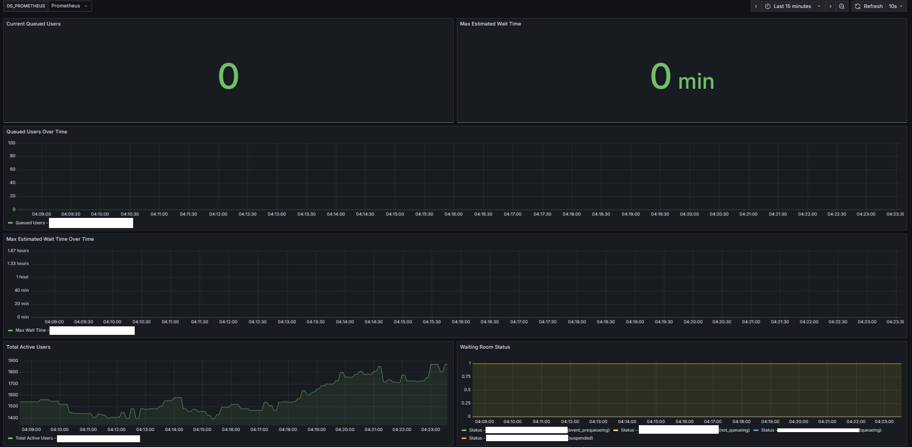

# Cloudflare Waiting Room Metrics Exporter

A Prometheus exporter for Cloudflare Waiting Room analytics that provides real-time metrics for monitoring queue length, wait times, active users, and requests served.



## Features

- Fetches Cloudflare Waiting Room analytics via API
- Exposes metrics in Prometheus format via `/metrics` endpoint
- Supports multiple waiting rooms
- Configurable via environment variables
- Includes Grafana dashboard
- Docker support

## Quick Start

1. Install dependencies:
```bash
pip install -r requirements.txt
```

2. Set environment variables:
```bash
export CF_API_TOKEN="your_cloudflare_api_token"
export CF_ZONE_ID="your_zone_id"
export CF_WAITING_ROOM_IDS="waiting_room_id_1,waiting_room_id_2"
```

3. Run the exporter:
```bash
python waitingroom_exporter.py
```

4. Access metrics at `http://localhost:8000/metrics`

## Configuration

| Environment Variable | Description | Default |
|---------------------|-------------|---------|
| `CF_API_TOKEN` | Cloudflare API token | Required |
| `CF_ZONE_ID` | Cloudflare Zone ID | Required |
| `CF_WAITING_ROOM_IDS` | Comma-separated list of waiting room IDs | Required |
| `POLL_INTERVAL` | Metrics refresh interval (seconds) | 60 |
| `HTTP_PORT` | HTTP server port | 8000 |

## Metrics

- `cf_waitingroom_queued_users{waitingroom="X"}` - Estimated number of users currently waiting in the queue
- `cf_waitingroom_total_active_users{waitingroom="X"}` - Estimated number of users currently active on the origin
- `cf_waitingroom_max_estimated_time_minutes{waitingroom="X"}` - Maximum estimated time currently presented to users in minutes
- `cf_waitingroom_status{waitingroom="X", status="Y"}` - Status of the waiting room (1 for current status, 0 for others)

## Prometheus Configuration

Add this to your `prometheus.yml`:

```yaml
scrape_configs:
  - job_name: 'cloudflare-waitingroom'
    static_configs:
      - targets: ['localhost:8000']
    scrape_interval: 30s
```

## Grafana Dashboard

Import the dashboard from `grafana-dashboard.json` to visualize the metrics with pre-configured panels for queue monitoring and wait time tracking.

## Docker

```bash
docker build -t waitingroom-exporter .
docker run -e CF_API_TOKEN=your_token -e CF_ZONE_ID=your_zone_id -e CF_WAITING_ROOM_IDS=room_ids -p 8000:8000 waitingroom-exporter
```